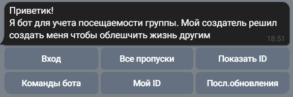
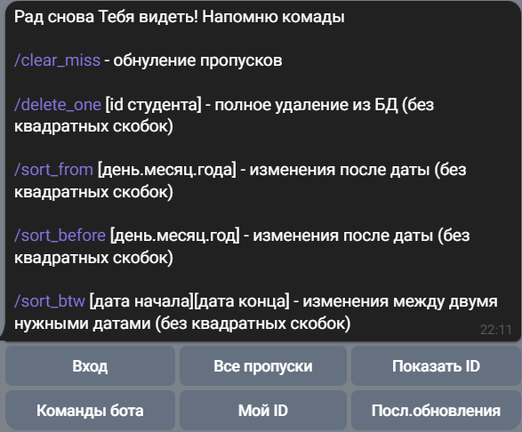
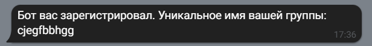
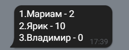
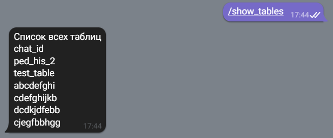
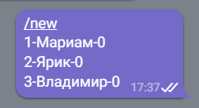
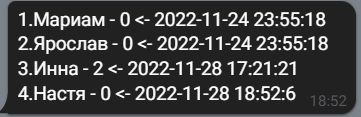

# Attendance-record-bot    "Бот учёта посещаемости"
Телеграмм бот для учета посещаемости группы
 
http://t.me/MyFirstUnusualbot
____
Использование
===========
Возможные варианты использования:
- Учет посещаемости группы
- Учет успеваемости группы (для бальной системы)
- Др. варианты 
____
Структура проекта
========
- core.py - Ядро для взаимодейстия драйвера БД и бота
- sqlite3_db_driver.py - драйвер для БД SQLite3
- text_messages.py - Тексты сообщений, которыми бот будет отвечать пользователю
- telegram_front.py - Оболочка взаимодейстия ядра и бота Telegram
- settings.py - Файл с токеном бота, паролем для очистки логов и БД (импортируется в core.py, в репозиторий не залит)
____
Технологии
===========
При работе дома используется библиотека БД sqlite3

Библиотека для взаимодействия с Telegram - aiogram

Библиотека для логгирования - logging
____
Интерфейс пользователя:
===========

>
>После нажатия кнопки /start бот предлагает несколько вариантов действий.
Команда старт отличается у зарегистрированного пользователя и незарегистрированного
- У незарегистрированного:
  >
- У зарегистрированного:
  >

Общие команды:
===========
- Команда "Вход авторизует пользователя и создает таблицу в БД"

  >

- >Команда "Все пропуски" возвращает пользователю список пропусков или баллов группы     

  >

- >Команда "Показать ID" возвращает список уникальных номеров студентов группы и их имена/

  >

- >Команда "Команды бота" возращает пользователю длинное сообщение с описанием возможных команд

- >Команда "Мой ID" возращает ID пользователя. ID пользователя поможет решить тех.проблемы, если такие возникнут

- >Вывод всех таблиц в БД

  >

Команды добавления и обновления:
===========
- >Добавление новых студентов производится в следующем порядке:

  >

- >Показ последних обновлений в БД:

  >

Сортировка изменений:
===========
- >Вывод изменений после определённой даты:

  >

- >Вывод изменений до определённой даты:

  >

- >Вывод изменений в определённый период между двумя датами:

  >

Команды удаления и обнуления:
===========
- >Удаление записи о студенте в таблице БД:

  >

- >Обнуление пропусков одного студента

  >

- >Очистка базы данных кроме таблицы chat_id (iD пользователя -> имя группы) осуществляется командой /clear_all_database и введением особого пароля:

  >

- >Удаление отдельной таблицы,например, с именем 'aboba'

  >

- >Очистка файла логов, также с паролем:

  >
