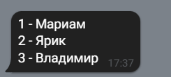

# Attendance-record-bot    "Бот учёта посещаемости"
Телеграмм бот для учета посещаемости группы
 
http://t.me/MyFirstUnusualbot
____
Использование
===========
Возможные варианты использования:
- Учет посещаемости группы
- Учет успеваемости группы (для бальной системы)
- Др. варианты 
____
Структура проекта
========
- core.py - Ядро для взаимодейстия с БД
- pshares.py - Тексты сообщений, которыми бот будет отвечать пользователю
- telegram_front.py - Оболочка взаимодейстия Б ядра и бота Telegram
- settings.py - Файл с токеном бота (импортируется в core.py, в репозиторий не залит)
____
Технологии
===========
При работе дома используется библиотека БД sqlite3

Библиотека для взаимодействия с Telegram - aiogram
____
Интерфейс
===========
>После нажатия кнопки /start бот предлагает несколько вариантов действий
>
>

>Команда "Вход авторизует пользователя и создает таблицу в БД"
>
>

>Команда "Все пропуски" возвращает пользователю список пропусков или баллов группы
>
>

>Команда "Показать ID" возвращает список уникальных номеров студентов группы и их имена/
>
>

>Команды "Команды бота" возращает пользователю длинное сообщение с описанием возможных команд

>Команда "Мой ID" возращает ID пользователя. ID пользователя поможет решить тех.проблемы, если такие возникнут

>Добавление новых студентов производится в следующем порядке
>
>
